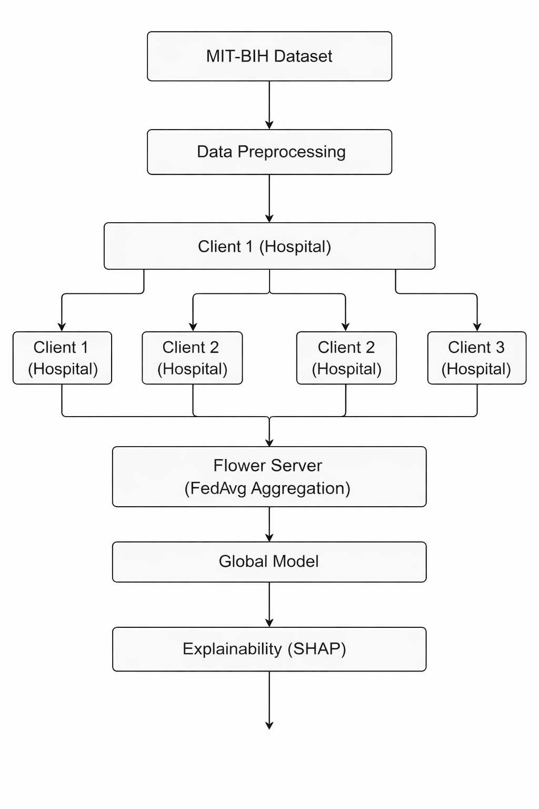
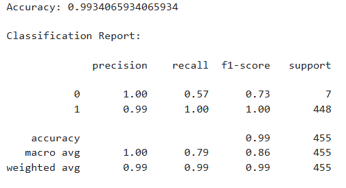
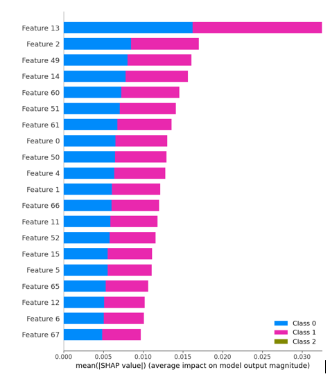
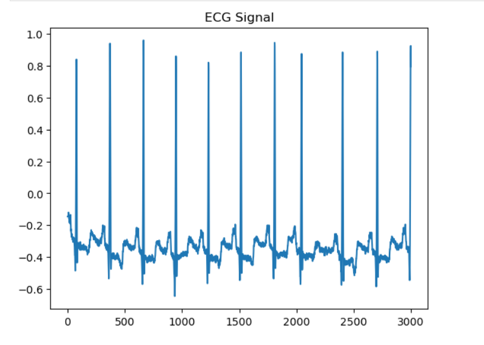

<p align="center">
  
  &nbsp;&nbsp;&nbsp;
</p>

<h2 align="center">DAYANANDA SAGAR UNIVERSITY</h2>

<p align="center">
School of Engineering <br>
Department of Computer Science and Engineering (Cyber Security)
</p>

<p align="center">
(A State Private University under the Karnataka Act No. 20 of 2013) <br>
Approved by UGC & AICTE, New Delhi
</p>

---
## Explainable Federated Learning for Secure and Transparent Medical Diagnosis in IoT-based Smart Hospitals 

**High-Fidelity ML-based ECG Classification using Federated Learning & Explainability**

**TTEH Lab**
                                  

---

## Badges


---


## Overview

This project presents an **ECG classification system using Federated Learning combined with Explainable AI (XAI)** for secure and transparent medical diagnosis.

Electrocardiogram (ECG) signals are widely used for detecting cardiac abnormalities, but sharing such sensitive patient data across hospitals raises serious privacy concerns. To address this, we implement a **Federated Learning framework** where multiple simulated hospitals (clients) train models locally on their own ECG data without sharing raw data.

A global model is then constructed by aggregating the locally trained models using the Flower federated learning framework.

In addition to model training, this project integrates **Explainability techniques (SHAP)** to interpret model predictions, enabling better transparency and trust in clinical decision-making.

The system is evaluated in both **centralized and federated settings**, demonstrating that federated learning can achieve comparable performance while preserving data privacy.

This work aims to contribute toward **privacy-preserving, interpretable AI solutions for smart healthcare systems**.

**Keywords:** `Federated Learning` `ECG Classification` `Explainable AI` `Healthcare AI` `Privacy-Preserving Machine Learning`

---

## Table of Contents

1. [Problem Statement](#-problem-statement)
2. [Proposed Architecture](#-proposed-architecture)
3. [System Architecture](#-system-architecture)
4. [Components](#components)
5. [How It Works](#-how-it-works)
6. [Performance Evaluation](#-performance-evaluation)
7. [Explainability](#-explainability)
8. [Code Architecture](#-code-architecture)
9. [Core Modules](#-core-modules)
10. [Setup & Usage](#-setup--usage)
11. [Implementation Results](#-implementation-results)
12. [Limitations](#-limitations)
  
---

## Problem Statement

Cardiovascular diseases are one of the leading causes of mortality worldwide. Early detection using ECG signals is crucial for timely diagnosis. However, training machine learning models on ECG data requires access to large amounts of patient data, which raises serious privacy and security concerns.

Traditional centralized learning approaches require data to be collected and stored in a single location, increasing the risk of data breaches and violating healthcare data regulations.

Therefore, there is a need for a **privacy-preserving, scalable, and interpretable system** that can:

- Train models without sharing sensitive medical data
- Maintain high diagnostic accuracy
- Provide transparency in model predictions

This project addresses these challenges using **Federated Learning and Explainable AI**.

---

## Proposed Architecture

The system follows a distributed federated learning pipeline where clients collaboratively train a global model without sharing raw data.

| Component            | Description                                                                 | Technology Used        |
|----------------------|-----------------------------------------------------------------------------|------------------------|
| ECG Dataset          | Raw ECG signals from MIT-BIH Arrhythmia Dataset                             | PhysioNet              |
| Data Preprocessing   | Signal extraction, segmentation, normalization, labeling                    | NumPy, WFDB            |
| Clients (Hospitals)  | Simulated distributed nodes training on local ECG data                      | Flower Clients         |
| Local Model          | ECG classification model trained independently at each client               | PyTorch                |
| Server               | Central aggregator coordinating federated learning                          | Flower Server          |
| Aggregation          | Combines model weights from all clients using Federated Averaging (FedAvg)  | Flower Strategy        |
| Global Model         | Updated shared model distributed back to clients                            | PyTorch                |
| Explainability       | Interprets model predictions using SHAP                                     | SHAP Library           |
| Results Storage      | Stores training results, logs, and plots                                    | Local Storage          |

---
## System Architecture

The proposed system follows a federated learning architecture with explainability support.



---

### Components:

- **Clients (Hospitals)** → Local ECG training
- **Server** → Model aggregation
- **Global Model** → Shared knowledge
- **Explainability Module** → SHAP-based interpretation

---
## How It Works

1. ECG data is loaded from the MIT-BIH dataset
2. Signals are preprocessed and converted into training samples
3. Data is split into multiple clients (simulated hospitals)
4. Each client trains a local model independently
5. Flower framework coordinates training across clients
6. Model weights are sent to the server
7. Server aggregates updates to create a global model
8. Process repeats for multiple rounds
9. Final global model is evaluated
10. SHAP is used to explain model predictions

---

## Performance Evaluation

### Centralized Model
- Trained on full dataset
- Achieves stable accuracy
- Serves as baseline for comparison

### Federated Model
- 3 simulated clients
- Model trained without sharing raw data
- Accuracy comparable to centralized approach

### Key Findings:
- Federated learning preserves privacy
- Minimal drop in accuracy compared to centralized model
- Model converges successfully across rounds

### Metrics Used:
- Accuracy
- Loss

### Conclusion:
Federated learning is effective for ECG classification while maintaining data privacy.

### Training Performance



---
## Explainability (SHAP)

To improve model transparency, SHAP (SHapley Additive Explanations) is used to interpret predictions.

- SHAP identifies which parts of the ECG signal contribute most to classification
- Helps understand model decision-making
- Important for clinical trust and validation

### Observations:
- Certain waveform regions (QRS complex) show higher importance
- Model focuses on key ECG patterns for classification

### Output:
- SHAP summary plots are generated and stored in the `results/` folder

---

## Code Architecture

```bash
ECG-Federated-Learning/
│
├── data/
├── notebooks/
├── results/
│   ├── .getkeep
│   ├── accuracy.png
│   ├── ecg_sample.png
│   ├── shap_plot.png
│   ├── system_architecture.png
├── src/
│   ├── model.py
│   ├── data_utils.py
│   ├── train_baseline.py
│   ├── federated_simulation.py
│   ├── explain.py
│   └── config.py
│
├── main.py
├── requirements.txt
└── README.md

```
---

## Core Modules

### 1. data_utils.py
Handles:
- Dataset loading
- ECG signal extraction
- Preprocessing
- Label creation

### 2. model.py
Defines:
- ECG classification model (1D CNN / simple model)

### 3. train_baseline.py
Implements:
- Centralized training
- Performance comparison

### 4. federated_simulation.py
Handles:
- Client creation
- Flower simulation
- Model aggregation

### 5. explain.py
Implements:
- SHAP explainability
- Visualization of feature importance

### 6. config.py
Contains:
- Hyperparameters
- Training settings

---

## Setup & Usage

### 1. Install dependencies
```bash
pip install -r requirements.txt
```
### 2. Download dataset

We use the **MIT-BIH Arrhythmia Dataset**

🔗 Download here:  
https://physionet.org/content/mitdb/1.0.0

Dataset is NOT included in this repository.

After downloading, place it inside:

data/
└── mit-bih-arrhythmia-database-1.0.0/

### 3. Run centralized training
```bash
python src/train_baseline.py
```
### 4. Run federated learning
```bash
python src/federated_simulation.py
```
### 5. Run explainability
```bash
python src/explain.py
```
---

## Implementation Results

- Successfully implemented federated learning with 3 simulated clients
- Verified model training across distributed datasets
- Achieved stable convergence across training rounds
- Demonstrated privacy-preserving training
- Generated SHAP plots for interpretability
- Compared centralized vs federated performance
### Training Accuracy


### SHAP Feature Importance



### Sample ECG Signal




---

## Limitations

- Simulation uses limited number of clients (3 hospitals)
- Dataset size is relatively small
- Model architecture is simple (can be improved)
- Federated learning overhead increases computation time
- SHAP explanations may be computationally expensive

---

## Contributors
   
| Name                 | USN         | Email                     |
|----------------------|-------------|---------------------------|
| Poorvika N           | ENG23CY0030 | poorvikan99@gmail.com     |
| B.Tanusree reddy     | ENG23CY0054 | bojja104@gmail.com        |
| D.Himaja Sri vyshnavi| ENG23CY0061 | himaja210205@gmail.com   |
| K N Navya            | ENG23CY0019 | knnavya27@gmail.com       |
| Pooja N              | ENG23CY0029 | poojanarayan0906@gmail.com|

---

## Mentor

**Dr. Prajwalasimha S N**  
Associate Professor, Department of Computer Science and Engineering (Cyber Security)  
School of Engineering, Dayananda Sagar University  

Email: prajwasimha.sn1@gmail.com


